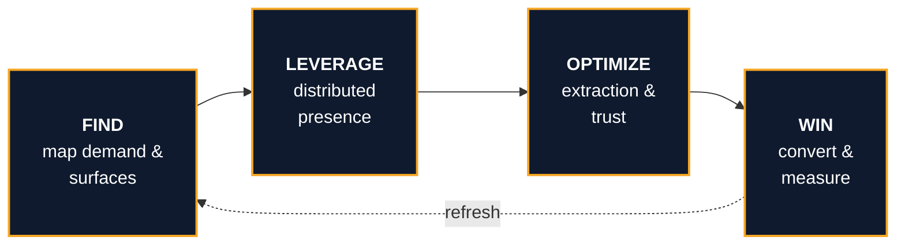
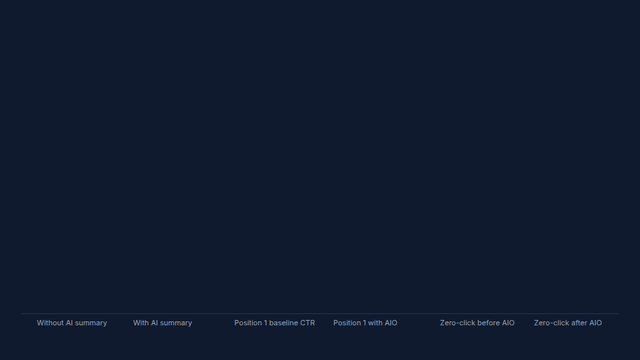
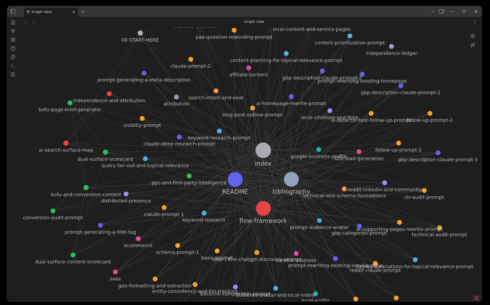
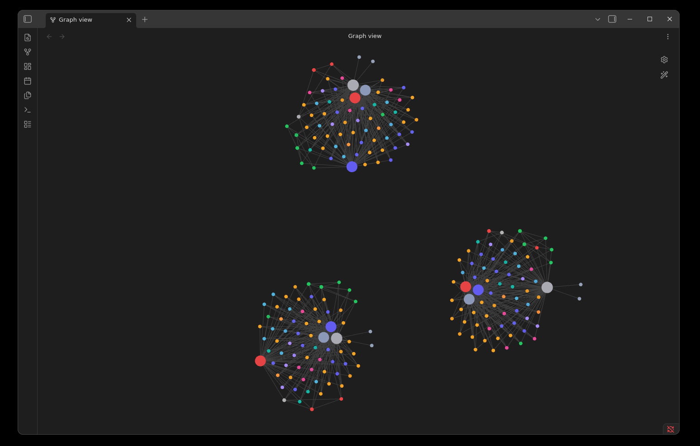
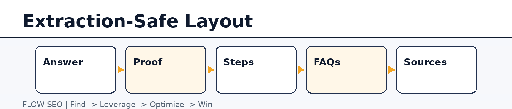
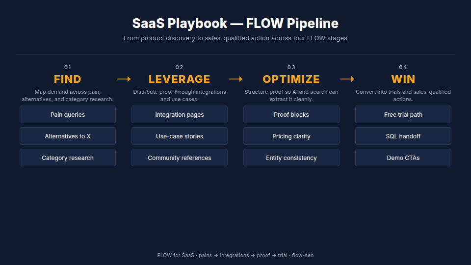

<div align="center">

<picture>
  <source media="(prefers-color-scheme: dark)" srcset="assets/diagrams/flow-hero.png">
  <source media="(prefers-color-scheme: light)" srcset="assets/diagrams/flow-hero-light.png">
  
</picture>

# FLOW SEO

**Find → Leverage → Optimize → Win.**
An evidence-led SEO knowledge base for humans and AI agents — built for 2026 search reality.

[](https://creativecommons.org/licenses/by/4.0/)
[](LICENSE.md)
[](llms.txt)
[](CHANGELOG.md)
[](https://github.com/AgriciDaniel/flow/releases)
[](https://github.com/AgriciDaniel/flow/stargazers)

[](docs/)
[](docs/09-prompts/)
[](assets/diagrams/)
[](docs/10-references/stats-provenance.json)

</div>

FLOW is a complete operating model for SEO in the AI-search era: classic organic visibility, AI Overviews and LLM citations, local search and Google Business Profile, off-site corroboration, and conversion measurement — all wired together with cited 2026 evidence and 42 standardized AI prompts.

---

## The FLOW loop



Each stage is a doc pillar. Each pillar has a What / Why-2026 / How-to-apply / Sources structure so a human reader, a search engine, and an AI agent can all extract from the same page.

## Why FLOW exists

Search in 2026 is not one results page and one click path. The same query can reach a buyer through Google organic, AI Overviews, ChatGPT or Perplexity citations, local pack listings, Reddit threads, YouTube videos, or LinkedIn discussions — often without a single visit to the brand's site. Most public SEO knowledge predates this reality.

<div align="center">

<picture>
  <source media="(prefers-color-scheme: dark)" srcset="assets/diagrams/flow-v4-surface-map.png">
  <source media="(prefers-color-scheme: light)" srcset="assets/diagrams/flow-v4-surface-map-light.png">
  
</picture>

</div>

FLOW treats those surfaces as one connected system. Every doc here is grounded in a 2026-current source with a retrieval date, every claim that couldn't be verified got dropped, and every prompt is reproducible by an AI agent reading from this repo.

## Evidence standard

Every public statistic in this repo carries:

- **Year anchor in prose** ("In 2026," / "As of Q1 2026,")
- **Inline citation** with publisher, title, page or URL
- **Source URL with retrieval date** in the [bibliography](docs/10-references/bibliography.md)

Unverifiable stats were dropped. Contradicted stats were replaced with verified alternatives. Three independent 2025–2026 datasets agree that AI Overviews materially reduce click-through to position one:

<div align="center">



</div>

The full provenance ledger lives at [`docs/10-references/stats-provenance.json`](docs/10-references/stats-provenance.json).

## Who this is for

| If you are… | Start with… |
|---|---|
| **A solo SEO operator or in-house marketer** | [`docs/00-START-HERE.md`](docs/00-START-HERE.md) → [`docs/01-framework/flow-framework.md`](docs/01-framework/flow-framework.md) |
| **A local-business owner or local-SEO consultant** | [`docs/07-local-seo/`](docs/07-local-seo/) — full pillar from map pack to property audits |
| **A B2B / SaaS / service-business strategist** | [`docs/08-playbooks/`](docs/08-playbooks/) — five business-type playbooks with stage-flow diagrams |
| **An AI agent** (Claude, GPT, Gemini, Cursor, Codex) | [`llms.txt`](llms.txt) → load context. [`docs/09-prompts/`](docs/09-prompts/) → 42 standardized prompts |
| **An Obsidian power user** | Clone this repo, open [`obsidian-vault/`](obsidian-vault/) as a vault — wikilinks and frontmatter intact |

## Quickstart

### Read on GitHub
1. Open [`docs/00-START-HERE.md`](docs/00-START-HERE.md)
2. Follow the entry-point map for your role
3. Each pillar doc has the same structure: *What this is · Why it matters in 2026 · How to apply · Sources*

### Pair with your AI agent
```bash
git clone https://github.com/AgriciDaniel/flow.git
cd flow
# Point Claude Code / Cursor / Codex / Gemini at this folder.
# Brief it: "Use FLOW as the framework. Cite the bibliography. No unsourced stats."
```
Then hand it real work: draft a brief, audit a page, plan a topic cluster, score a service page on the [dual-surface scorecard](docs/06-win/dual-surface-scorecard.md).

### Ingest into SEO-Agent brain

[SEO-Agent](https://github.com/AgriciDaniel/claude-seo) is the primary AI consumer of FLOW. It ingests all 72 docs into a persistent brain so every session starts with FLOW doctrine in context:

```bash
# From SEO-Agent repo root — mirrors + ingests in one command
python claude-seo/scripts/sync_flow_content.py
```

See [CLAUDE.md](CLAUDE.md) for the full integration guide.

### Run as Obsidian vault
1. Clone the repo
2. Open [`obsidian-vault/`](obsidian-vault/) in Obsidian (Open folder as vault)
3. Wikilinks, frontmatter, and the canvas mirror work out of the box

The bundled `.obsidian/graph.json` ships with a tag-based color scheme so the FLOW pillars are visible at a glance. Open the graph view (`Ctrl+G`) to navigate the 78 cross-linked notes:

<div align="center">



</div>

The graph filter ships scoped to `obsidian-vault/`, so the duplicate `docs/` tree at the repo root and the standards files don't crowd the canvas. The same data with `showOrphans: false` and the path filter applied collapses to three focused clusters:

<div align="center">



</div>

## What's inside

<div align="center">

| Stage | Sample diagram | Live in |
|:---:|:---:|:---|
| **FIND** | <picture><source media="(prefers-color-scheme: dark)" srcset="assets/diagrams/flow-v4-query-fanout.png"></picture> | [`docs/03-find/`](docs/03-find/) |
| **LEVERAGE** | <picture><source media="(prefers-color-scheme: dark)" srcset="assets/diagrams/flow-v4-distributed-presence.png"></picture> | [`docs/04-leverage/`](docs/04-leverage/) |
| **OPTIMIZE** | <picture><source media="(prefers-color-scheme: dark)" srcset="assets/diagrams/flow-v4-extraction-layout.png"></picture> | [`docs/05-optimize/`](docs/05-optimize/) |
| **WIN** | <picture><source media="(prefers-color-scheme: dark)" srcset="assets/diagrams/flow-v4-win-stage.png"></picture> | [`docs/06-win/`](docs/06-win/) |
| **LOCAL** | <picture><source media="(prefers-color-scheme: dark)" srcset="assets/diagrams/flow-v4-local-seo-system.png"></picture> | [`docs/07-local-seo/`](docs/07-local-seo/) |
| **PLAYBOOKS** |  | [`docs/08-playbooks/`](docs/08-playbooks/) |

</div>

Plus four animated Remotion visuals anchored to verified statistics: AI Overviews click reduction, Google Business Profile completeness uplift, ChatGPT local source mix, and the dual-surface scorecard.

## Repository structure

```
flow/
├── README.md                    ← you are here
├── LICENSE.md                   ← CC BY 4.0 (content) + MIT (scripts)
├── CONTRIBUTING.md              ← how to propose corrections / additions
├── CODE_OF_CONDUCT.md           ← Contributor Covenant 2.1
├── CHANGELOG.md                 ← release history
├── SECURITY.md                  ← vulnerability disclosure policy
├── llms.txt                     ← AI crawler manifest (llmstxt.org spec)
├── llms-full.txt                ← concatenated full-content variant for agent ingestion
├── docs/
│   ├── 00-START-HERE.md
│   ├── 01-framework/            ← FLOW framework, AI search surface map
│   ├── 02-foundations/          ← search intent, E-E-A-T, technical / schema
│   ├── 03-find/                 ← keyword research, audience avatar, query fan-out
│   ├── 04-leverage/             ← distributed presence, citations, Reddit + LinkedIn
│   ├── 05-optimize/             ← GEO formatting, entity consistency, CTR, schema
│   ├── 06-win/                  ← BOFU + conversion, PPC + first-party, scorecard
│   ├── 07-local-seo/            ← Local SEO pillar (map pack, GBP, property audits)
│   ├── 08-playbooks/            ← SaaS / Ecommerce / Service / B2B / Affiliate
│   ├── 09-prompts/              ← 42 standardized AI prompts
│   └── 10-references/           ← bibliography, attribution, independence ledger
├── assets/
│   ├── diagrams/                ← FLOW-native diagrams (PNG + animated GIF)
│   ├── canvases/                ← Obsidian canvas exports
│   └── social-preview.png       ← GitHub social card
├── obsidian-vault/              ← parallel mirror with wikilinks + frontmatter
├── examples/                    ← worked examples per pillar
└── scripts/
    └── check_docs.py            ← evidence-standard CI check
```

## What this is not

- **Not a replacement for hands-on testing.** Every tactic should be validated against your specific business, audience, and search surfaces.
- **Not a one-time read.** Search shifts faster than annual ebooks can keep up. The bibliography is dated; the framework is not.
- **Not a derivative-work fork** of any single source book. FLOW is independent original work that acknowledges the influence of *Ski Slope Strategy 3.0* by Chris Von Wilpert (Content Mavericks). See [`docs/10-references/attribution.md`](docs/10-references/attribution.md).

## Contributing

Corrections, source improvements, and 2026-current citations are welcome. See [`CONTRIBUTING.md`](CONTRIBUTING.md) for the evidence standard, prompt schema, and PR checklist.

Found an outdated statistic? Open an issue using the **[Source correction](https://github.com/AgriciDaniel/flow/issues/new?template=source-correction.md)** template — it's the highest-value contribution this repo accepts.

## Maintainer

**Daniel Agrici** — built FLOW as a 2026 reframing of decade-old SEO methodology against current AI-search reality. Connect via the repo's [Discussions](https://github.com/AgriciDaniel/flow/discussions) tab.

## License

- **Content** (Markdown, diagrams, prompt text, examples): [CC BY 4.0](https://creativecommons.org/licenses/by/4.0/)
- **Code** (scripts, workflows, configs): [MIT](LICENSE.md)
- **Influence acknowledgment**: see [`LICENSE.md`](LICENSE.md) and [`docs/10-references/attribution.md`](docs/10-references/attribution.md)

You can use, adapt, and redistribute the content commercially with attribution. Scripts can be forked without copyleft.

---

<div align="center">

*If FLOW helps you ship something, star the repo and share the framework.
That's the attribution chain that keeps the evidence layer current.*

</div>
